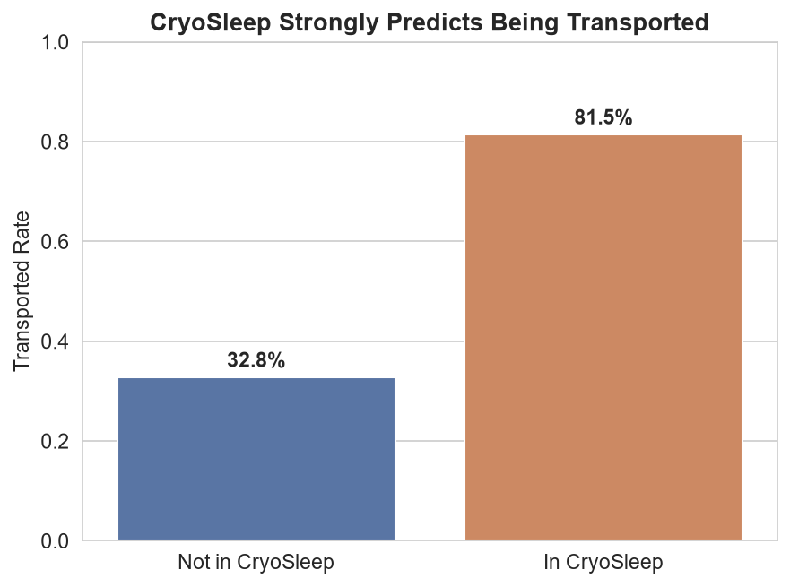
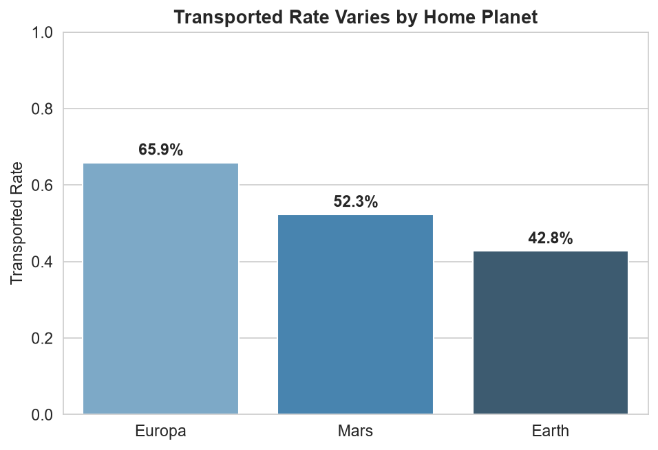
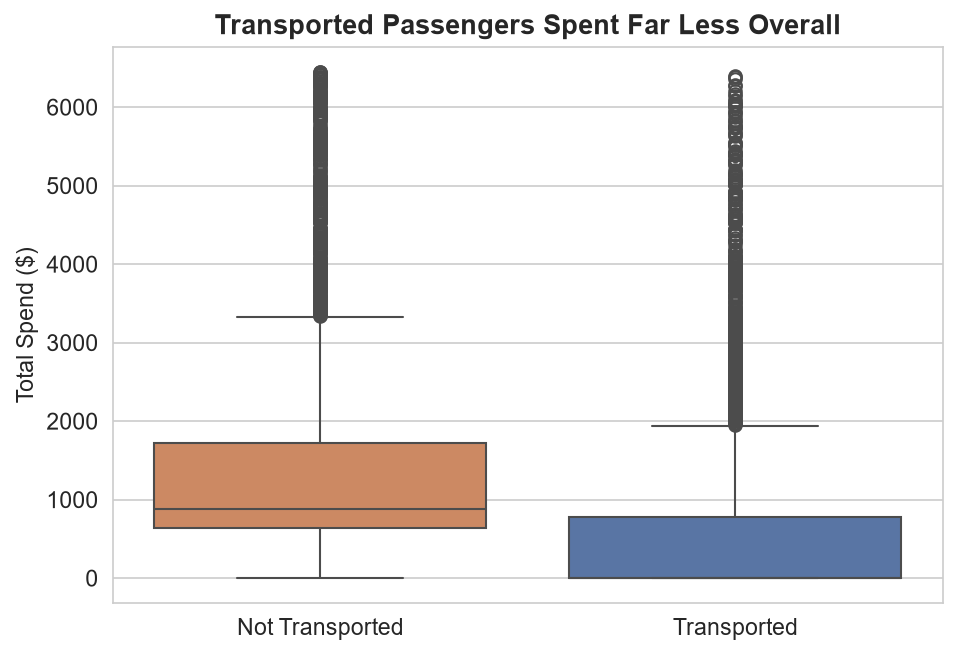
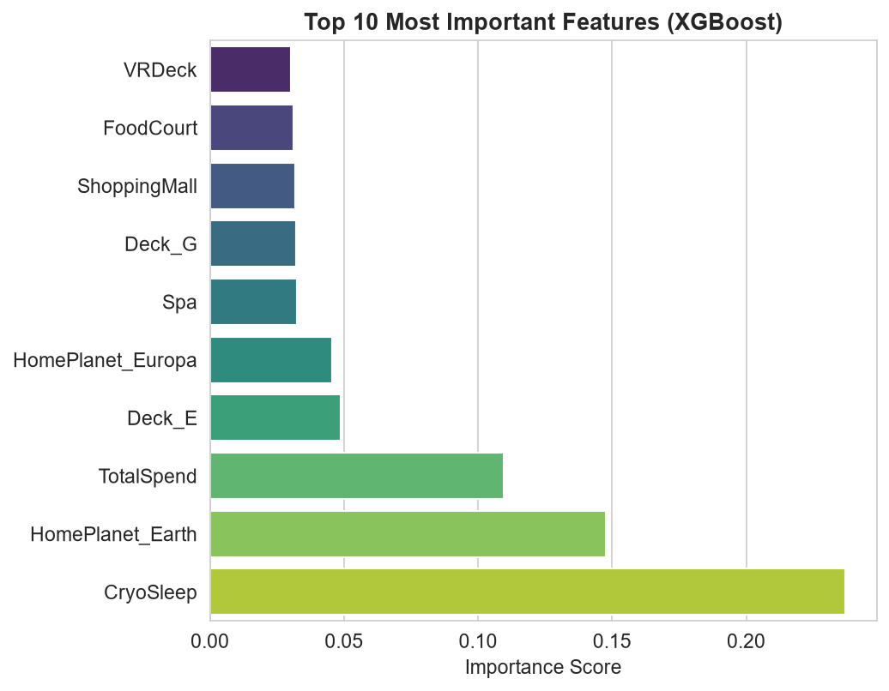
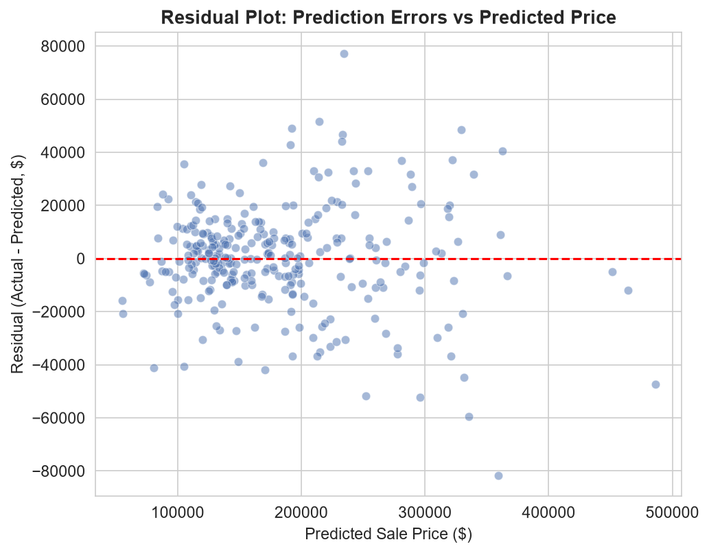
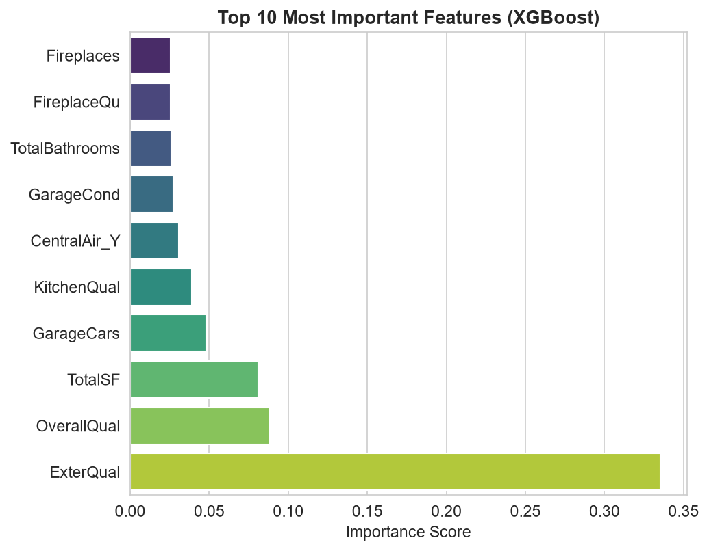
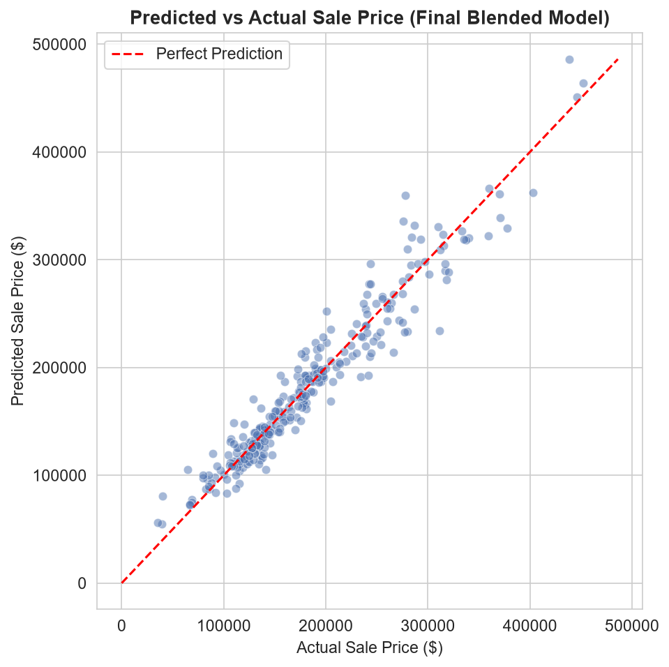

# Payoda Machine Learning Assignment


This repository contains solutions for two problems as part of the Payoda ML Engineer take-home assignment:

1. **P1 — Spaceship Titanic** (Mandatory) — Binary Classification
2. **P2 — House Prices** (Chosen second problem) — Regression 

---

## P1 — Spaceship Titanic

### Problem
Predict whether each passenger aboard the Spaceship Titanic was transported to an alternate dimension (`Transported`: True/False), based on demographic, travel, and spending data. Evaluated on classification accuracy.

### Approach

**1. Exploratory Data Analysis**
Used statistical group-based analysis (bivariate transported-rate comparisons) to validate hypotheses before engineering features. Key findings:

- **CryoSleep is the strongest single predictor**: 32.9% transported rate when False vs. 81.8% when True.
- **CryoSleep=True implies exactly zero spending** across all five amenity columns — a deterministic relationship, not just correlation. Used this to intelligently impute missing `CryoSleep` values.
- **Deck (from Cabin) shows a wide spread**: transported rates ranged from 20% (Deck T) to 73% (Deck B), suggesting the anomaly's effect varied by physical ship location.
- **HomePlanet matters**: Europa passengers (65.9%) transported at much higher rates than Earth (42.8%).
- **Children (age 0–12) were transported at 66.9%**, notably higher than all other age groups (~47–54%).
- **87% of passenger groups (derived from PassengerId) shared an identical Transported outcome** — either everyone in the group was transported, or no one was. This is a powerful pattern, but I determined it **cannot be used as a model feature** without data leakage, since test-set groupmates' true outcomes are unknown by definition. Documented as an insight rather than misused as a feature — see notebook for the full leave-one-out investigation and reasoning.

**2. Missing Value Handling**
Every feature column had 2.0–2.5% missing values (no column catastrophically empty), suggesting values were missing largely at random rather than systematically. Handling strategy:
- `CryoSleep`: inferred from spending pattern (0 spend → True, any spend → False)
- Spending columns: 0 for confirmed CryoSleep passengers, median (from train only) otherwise
- Categorical columns (`HomePlanet`, `Destination`, `Deck`, `Side`, `VIP`): mode imputation
- `Age`, `CabinNum`: median imputation

**3. Feature Engineering**
- Split `Cabin` into `Deck`, `CabinNum`, `Side`
- Extracted `GroupSize` from `PassengerId` prefix
- Created `TotalSpend` (sum of 5 amenity columns)
- One-hot encoded `HomePlanet`, `Destination`, `Deck`; binary-encoded `CryoSleep`, `VIP`, `Side`

**4. Modeling & Validation**
Compared three models using 5-fold Stratified Cross-Validation on the training set:

| Model | CV Mean Accuracy | CV Std |
|---|---|---|
| Logistic Regression | 0.7908 | 0.0041 |
| Random Forest | 0.7981 | 0.0099 |
| **XGBoost (tuned)** | **0.8089** | ~0.004 |

XGBoost was selected as the final model — best accuracy and most consistent across folds. Hyperparameters tuned via `RandomizedSearchCV` (30 iterations, 5-fold CV).

**Final held-out validation metrics (XGBoost):**

| Metric | Value |
|---|---|
| Validation Accuracy | 0.8206 |
| Precision | 0.8279 |
| Recall | 0.8128 |
| F1 Score | 0.8203 |
| ROC-AUC | 0.9069 |
| Log Loss | 0.3885 |

**Feature importance** (top 3, from tuned XGBoost): `CryoSleep` (23.7%), `HomePlanet_Earth` (14.8%), `TotalSpend` (11.0%) — directly consistent with EDA findings, confirming the engineered features and imputation strategy were genuinely informative rather than arbitrary.

### Benchmark context
Public solutions on this competition's leaderboard (including "Top 100" writeups) typically score 80–81% accuracy; this dataset has a known realistic ceiling around there due to inherent noise not explainable by the given features. This model's 80.89% CV accuracy sits at that competitive level.

### Key Visualizations

**CryoSleep strongly predicts being transported:**



**Transported rate varies notably by Home Planet:**



**Transported passengers spent far less overall (consistent with high CryoSleep rate):**



**Feature importance confirms EDA findings — CryoSleep, HomePlanet, and TotalSpend dominate:**



### How to Run

```bash
# From the ML-Assignment root folder
python -m venv .venv
.venv\Scripts\activate        # Windows
pip install -r requirements.txt

cd p1-spaceship-titanic
# Open p1_spaceship_titanic.ipynb in VS Code / Jupyter and run all cells
```

Requires `train.csv`, `test.csv`, `sample_submission.csv` from the [Kaggle competition data page](https://www.kaggle.com/competitions/spaceship-titanic/data) placed inside `p1-spaceship-titanic/` (not included in this repo per Kaggle's data redistribution terms).

### Artifacts
- Notebook: `p1-spaceship-titanic/p1_spaceship_titanic.ipynb`
- Submission: `p1-spaceship-titanic/submission.csv`
- EDA plots: `p1-spaceship-titanic/plot1_cryosleep.png` through `plot4_feature_importance.png`
- Requirements: `requirements.txt` (root)

### AI Usage Disclosure
Used Claude (Anthropic) for step-by-step guidance on pipeline structure, explaining concepts, and debugging (e.g., train/test column-order mismatch). All code was run, verified, and understood by the candidate; modeling decisions and workbook entries are the candidate's own.

---

## P2 — House Prices: Advanced Regression Techniques

### Problem
Predict the sale price (`SalePrice`) of residential homes in Ames, Iowa, using 79 explanatory variables covering nearly every aspect of a house (size, quality, location, age, amenities). Evaluated on RMSE of log-transformed SalePrice.

Competition link: https://www.kaggle.com/competitions/house-prices-advanced-regression-techniques

### Approach

**1. Target Analysis**
`SalePrice` was heavily right-skewed (skewness 1.88) — a log transform (`log1p`) reduced this to near-symmetric (0.12), matching the competition's own evaluation metric.

**2. Missing Value Handling — Structural vs Genuine**
Unlike P1, most missingness here is **structural**, not random. Cross-referenced `data_description.txt` and confirmed that for 15 columns (PoolQC, Fence, GarageType, BsmtQual, etc.), `NA` explicitly means "feature absent" (e.g., no pool, no garage), not unknown data — these were filled with a `"None"` category rather than statistically imputed. Remaining genuine gaps: `LotFrontage` (filled via neighborhood median — location-aware), `GarageYrBlt`/`MasVnrArea` (filled 0, consistent with "no garage/veneer"), `Electrical` (mode).

**3. Outlier Removal**
Identified and removed 2 well-documented dataset anomalies (houses with `GrLivArea` > 4000 sqft but `SalePrice` < $300k). Confirmed via correlation analysis these defied the expected size-price relationship. Removing them reduced CV RMSE from 0.1427 to 0.1131 and cut fold-to-fold variance roughly 3x.

**4. Feature Engineering**
- `TotalSF` (basement + 1st + 2nd floor sqft) — correlation 0.78 with SalePrice, nearly matching OverallQual
- `TotalBathrooms` (weighted full + half baths) — correlation 0.63
- `HouseAge`, `YearsSinceRemodel` — both show expected negative correlation with price

**5. Encoding**
- 10 quality-rating columns (ExterQual, BsmtQual, KitchenQual, etc.) — **ordinally encoded** (None=0 → Excellent=5), preserving their genuine rank order rather than losing it to one-hot encoding
- 33 remaining categorical columns — one-hot encoded; fixed a 16-column train/test mismatch caused by rare categories

**6. Modeling**
Compared Ridge, Lasso, and XGBoost via 5-fold cross-validation on the log-transformed target:

| Model | CV Mean RMSE (log) |
|---|---|
| **Ridge (scaled)** | **0.1130** |
| Lasso (scaled) | 0.1140 |
| XGBoost (tuned) | 0.1151 |

Notably, regularized linear models slightly outperformed tuned XGBoost — a real, non-obvious result given this dataset's high feature-to-row ratio (266 features, ~1460 rows), where regularization matters more than tree-based non-linearity. Final model: a 70/30 weighted blend of Ridge and XGBoost, chosen for robustness across validation splits.

**Final validation metrics:**

| Metric | Value |
|---|---|
| Validation RMSLE (log scale) | 0.1159 |
| Kaggle Public RMSLE | 0.1326 |
| MAE (in $) | $13,849 |
| R² | 0.9203 |

**Top 5 features (XGBoost importance):** ExterQual, OverallQual, TotalSF (engineered), GarageCars, BsmtQual.

### Key Visualizations

**Residual analysis — errors are roughly balanced around zero, no severe systematic bias:**



**Feature importance — quality ratings and engineered TotalSF dominate:**



**Predicted vs Actual — final blended model predictions closely track true sale prices:**



### How to Run

```bash
# From the ML-Assignment root folder (same environment as P1)
cd p2-house-prices
# Open p2_house_prices.ipynb in VS Code / Jupyter and run all cells
```

Requires `train.csv`, `test.csv`, `sample_submission.csv`, `data_description.txt` from the [Kaggle data page](https://www.kaggle.com/competitions/house-prices-advanced-regression-techniques/data) placed inside `p2-house-prices/`.

### Artifacts
- Notebook: `p2-house-prices/p2_house_prices.ipynb`
- Submission: `p2-house-prices/submission.csv`
- Plots: `p2-house-prices/plot1_residuals.png`, `plot2_feature_importance.png`, `plot3_predicted_vs_actual.png`

### AI Usage Disclosure
Same as P1 — used Claude for step-by-step guidance, explanations, and debugging; all code run, verified, and understood by the candidate.
